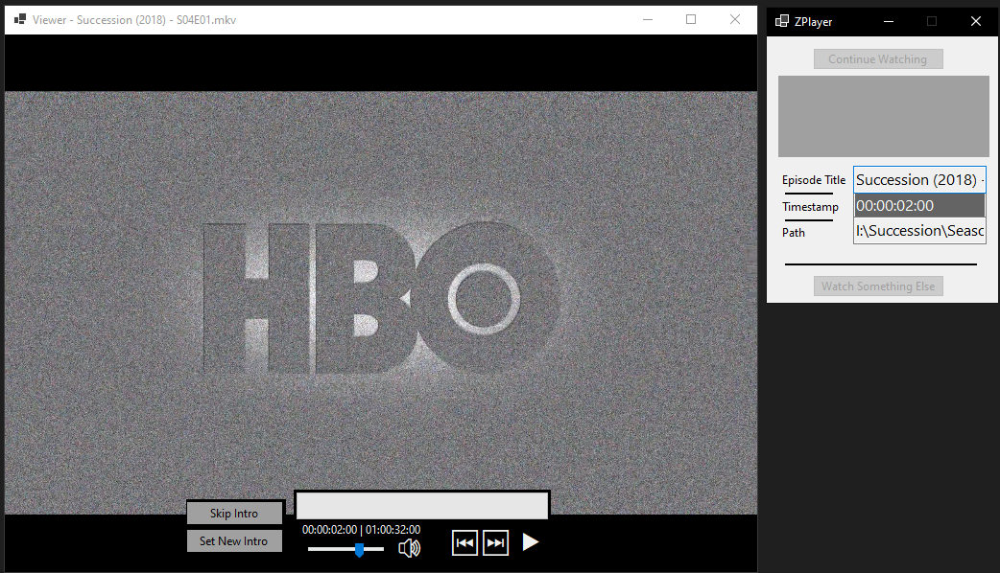
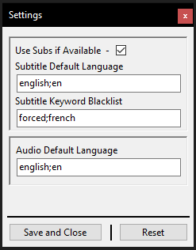

# WINFORMS-VLCClient

A Windows Forms video player built with LibVLCSharp.

## Features

- Video Playback using VLC's libvlc backend.
- Ability to "Right Click -> Open With -> VLCZViewer.exe" On Windows.
- Playback Controls (Play/Pause, Mute, Timeline Seeking).
    - Mouse Wheel Up/Down will also seek the video when hovering over the Timeline.
- Watch History with Timestamp persistence (resume where you left off).
- Skip Intro (after you mark it).
- Auto Play next in folder.
- Alt+F9 will toggle Play/Pause.
- F11 to toggle Fullscreen.
- Embedded and Custom subtitles accessed via right-click menu.  - Dragging and dropping also works for subtitle files.

 
 

Player and Viewer - 
 
 
 

Settings Example -  
 

## Requirements

- .NET 9.0 (Windows)
- Windows OS

## Dependencies

- [LibVLCSharp](https://github.com/videolan/libvlcsharp) (3.9.5)
- [LibVLCSharp.WinForms](https://github.com/videolan/libvlcsharp) (3.9.5)
- [VideoLAN.LibVLC.Windows](https://www.nuget.org/packages/VideoLAN.LibVLC.Windows) (3.0.23)
